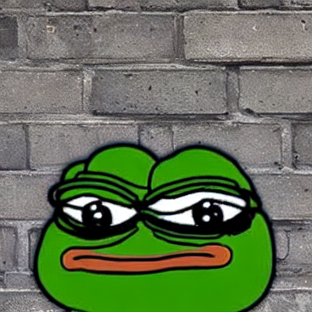
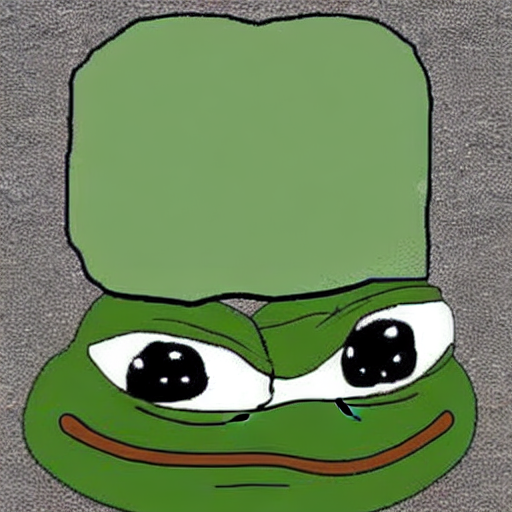
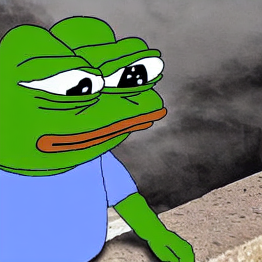

<!-- This model card has been generated automatically according to the information the training script had access to. You
should probably proofread and complete it, then remove this comment. -->


# LoRA text2image fine-tuning - RobertoNeglia/pepe_generator
These are LoRA adaption weights for runwayml/stable-diffusion-v1-5. The weights were fine-tuned on the RobertoNeglia/pepe_dataset dataset. You can find some example images in the following. 






## Intended uses & limitations

#### How to use

```python
from diffusers import StableDiffusionPipeline
import torch
import matplotlib.pyplot as plt

model_path = "RobertoNeglia/pepe_generator_sd2" # or RobertoNeglia/pepe_generator for SD1.5, or your own model path
pipe = StableDiffusionPipeline.from_pretrained("stabilityai/stable-diffusion-2", torch_dtype=torch.float16) # or "runwayml/stable-diffusion-v1-5" for SD1.5
pipe.unet.load_attn_procs(model_path)
pipe.to("cuda")

prompt = "A very sad Pepe the Frog, crying in a dark room, digital art"
image = pipe(prompt, num_inference_steps=30, guidance_scale=7.5).images[0]
plt.imshow(image)
plt.axis("off")
plt.show()
```

<!-- #### Limitations and bias

[TODO: provide examples of latent issues and potential remediations]

## Training details

[TODO: describe the data used to train the model] -->